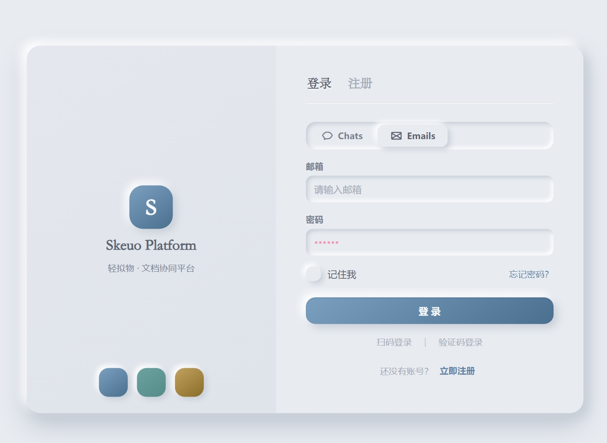
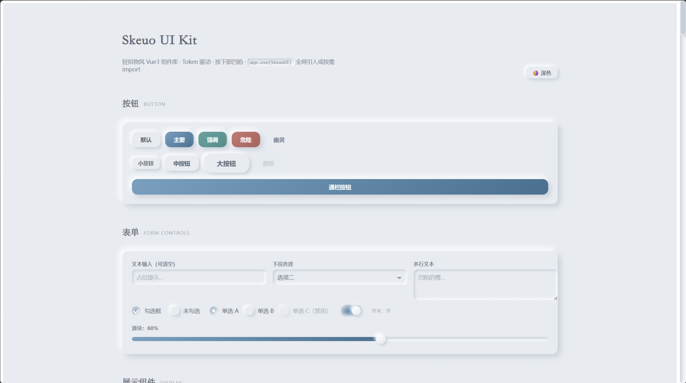
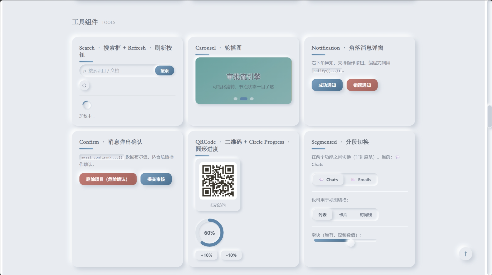

<p align="center">
  
</p>

<h1 align="center">Skeuo UI</h1>

<p align="center">
  <strong>纯正 Neumorphism（新拟物）风格 Vue3 组件库</strong>
  <br />
  73 个组件 · TypeScript Strict · 阴影即边界，无边框无渐变
</p>

<p align="center">
  <a href="https://www.npmjs.com/package/skeuo-ui"></a>
  <a href="https://img.shields.io/npm/l/skeuo-ui"></a>
  
  
</p>

---

## ✨ 特性

- 🎨 **纯正新拟物** — 同色背景 + 双向柔和阴影，凸起与凹陷一目了然。无边框、无渐变、无纹理、无发光
- ⚡️ **Vue3 + TS Strict** — 全部 `<script setup>` 编写，类型导出完整，strict 模式零 `any`
- 🌗 **浅深双主题** — 纯 CSS 变量 Token 驱动，`data-theme="dark"` 一键切换
- 🧩 **73 个组件** — 表单 / 展示 / 反馈 / 导航 / 工具 / 页面全品类覆盖
- 📦 **双模式引入** — `app.use(SkeuoUI)` 全量 / 按需导入
- 📊 **图表封装** — SChart 基于 ECharts **按需注册**，只打包用到的图表类型（体积 -37%）
- 🔔 **编程式 API** — `message` / `notification` / `confirm` 开箱即用
- 🚀 **可发布** — ESM + UMD + 类型声明，`npm pack` 真实安装验证通过
- 以下为部分展示，效果图在./docs/public中 ヾ(*´∀ ˋ*)ﾉ

<p align="center">
  
  
  
</p>

## 📚 文档

完整组件文档在 `docs/` 目录（VitePress 构建），本地运行 `npm run docs:dev` 预览。
部署后可访问在线文档站（未部署前此为占位说明）。

## 🔧 安装

```bash
npm install skeuo-ui
```

## 🚀 快速上手

### 全量引入

```ts
// main.ts
import { createApp } from 'vue'
import SkeuoUI from 'skeuo-ui'
import 'skeuo-ui/style.css'

const app = createApp(App)
app.use(SkeuoUI)
app.mount('#app')
```

### 按需引入

```ts
import { SButton, SInput, message } from 'skeuo-ui'
import 'skeuo-ui/style.css'
```

### 编程式 API

```ts
import { message, notification, confirm } from 'skeuo-ui'

message.success('保存成功')
notification.info('任务完成', '文档已生成')

const ok = await confirm('确定删除该项目吗？', {
  okType: 'danger',
})
if (ok) {
  // 执行删除
}
```

## 🌗 深色模式

```ts
// 在 <html> 上设置 data-theme="dark"
document.documentElement.setAttribute('data-theme', 'dark')
```

浅色为默认（`#f7f6f2` 微暖白底），深色自动切换整套阴影与色彩。组件内部样式 scoped 自足，只需引入一次全局样式。

## 🧩 组件清单

### 表单类

| 组件 | 说明 |
| --- | --- |
| `SButton` 按钮 | 6 种类型 × 3 种尺寸，通栏/禁用/加载 |
| `SInput` 输入框 | 前缀图标/可清空/密码显隐 |
| `STextarea` 文本域 | 行数/最大长度/禁用 |
| `SSelect` 下拉选择 | 单选/禁用项/分组 |
| `SCheckbox` 勾选框 | 单选/全选 |
| `SRadio` / `SRadioGroup` 单选框 | 水平/垂直 |
| `SSwitch` 开关 | 加载/禁用 |
| `SSlider` 滑块 | 单选 + **Range 双滑块** |
| `SInputNumber` 数字输入 | min/max/step/precision |
| `SRate` 评分 | 支持半星 |
| `SSearch` 搜索框 | 可清空/回车搜索 |
| `SForm` / `SFormItem` 表单 | 同步校验 + 错误提示 |
| `SDatePicker` 日期 | 完整月面板 42 格 |
| `STimePicker` 时间 | 时分选择 |
| `SDateRangePicker` 日期范围 | 起止日期 + 区间高亮 |
| `SColorPicker` 颜色 | 预设色 + HSV 调色盘 |
| `SCascader` 级联 | 多级联动选择 |
| `SCodeInput` 验证码 | OTP 风格，自动跳格/粘贴 |
| `SCalendar` 日历 | 月视图/标记日期 |

### 展示类

| 组件 | 说明 |
| --- | --- |
| `SCard` 卡片 | 标题/阴影层级 |
| `STag` 标签 | 5 色可关闭 |
| `SAvatar` 头像 | 图片/文字/加载失败回退 |
| `SProgress` 进度条 | 线形 + **圆形 SVG** |
| `STabs` / `STab` 标签页 | 禁用/切换动画 |
| `SBadge` 徽章 | 数字/`99+`/红点/零隐藏 |
| `SEmpty` 空状态 | 拟物插画 |
| `SSkeleton` 骨架屏 | 行/头像/动画 |
| `SQRCode` 二维码 | 自动重绘 |
| `SImage` 图片 | 点击放大预览 |
| `SChart` 图表 | ECharts 按需注册，6 图表类型 |
| `SStatistic` 统计 | 千分位/前后缀 |
| `SDescriptions` 描述列表 | 网格详情展示 |
| `SNumberAnimate` 数字滚动 | easeOut 动画 |
| `SWatermark` 水印 | canvas 生成 |
| `STree` 树形 | 多级折叠/图标 |

### 反馈类

| 组件 | 说明 |
| --- | --- |
| `message` 轻提示 | 4 类型/位置/最多 3 条 |
| `notification` 通知 | 角落弹窗/操作按钮 |
| `confirm` 确认框 | Promise 风格 |
| `SMessage` 消息条（组件形态） | 常驻/可关闭 |
| `SNotification` 通知卡片（组件形态） | 标题/正文/操作按钮 |
| `SConfirmDialog` 确认对话框（组件形态） | danger 确认/static 内嵌 |
| `SModal` 对话框 | 遮罩/标题/插槽/关闭 |
| `SPopconfirm` 气泡确认 | 轻量确认 |
| `SAlert` 警告条 | 4 类型可关闭 |
| `SResult` 结果页 | 成功/错误/空/404 |
| `SUpload` 上传 | 多文件/大小限制 |
| `STooltip` 悬浮提示 | 4 方向 |

### 导航类

| 组件 | 说明 |
| --- | --- |
| `STable` 表格 | 列配置/插槽 |
| `SPagination` 分页 | 省略号智能折叠 |
| `SBreadcrumb` 面包屑 | 自定义分隔符 |
| `SDivider` 分割线 | 水平/垂直/内凹 |
| `STimeline` 时间线 | 审批流配色 |
| `SSteps` 步骤条 | 方向/状态 |
| `SCollapse` 折叠面板 | 手风琴 |
| `SDrawer` 抽屉 | 4 方向 |
| `SPageHeader` 页头 | 返回/标题/操作 |
| `SAnchor` 锚点 | 滚动监听 |
| `SBackTop` 回到顶部 | 阈值控制 |

### 工具类

| 组件 | 说明 |
| --- | --- |
| `SCarousel` 轮播 | **拖拽切换**（45% 阈值）+ 箭头/指示器 |
| `SSpinner` 加载 | 拟物旋转 |
| `SRefreshButton` 刷新 | 旋转动画 |
| `SSegmented` 分段 | 功能切换 |
| `SDropdown` 下拉菜单 | 危险项/分隔线 |
| `SContextMenu` 右键菜单 | 视口自适应 |
| `SCopy` 复制 | clipboard + 降级 |
| `SEllipsis` 省略 | 单行/多行可展开 |
| `SFullScreen` 全屏 | 浏览器全屏 API |
| `SInfiniteScroll` 无限滚动 | IntersectionObserver |
| `SLazyLoad` 懒加载 | 进视口才加载 |
| `STransfer` 穿梭框 | 搜索/禁用项 |

### 页面

| 组件 | 说明 |
| --- | --- |
| `SAuthPage` 登录/注册 | 密码/扫码/验证码三种登录 + 5 平台滑条切换二维码 |
| `SVerifyPage` 验证码页 | 手机/邮箱 + 60s 倒计时 + OTP 输入 |

## 🎨 设计原则

**纯正 Neumorphism**：同一背景色上同时存在亮影与暗影。

```
凸起（按钮/卡片）          凹陷（输入框/轨道）
┌──────────┐              ┌──────────┐
│ 亮↖ 暗↘  │              │ 暗↖ 亮↘  │
└──────────┘              └──────────┘
```

- ❌ 无边框（用阴影替代）· ❌ 无渐变 · ❌ 无纹理
- ✅ 全部样式走 CSS 变量 Token（`--s-*`），改一处全局生效
- ✅ 浅色 `#f7f6f2` / 深色 `data-theme="dark"`

## 🛠 开发

```bash
npm install          # 安装依赖
npm run dev          # 启动组件实验室（playground）
npm run build        # 构建产物（vue-tsc + vite build）
npm run docs:dev     # 启动文档站
npm run docs:build   # 构建文档站
npm run gen:docs     # 从源码重新生成组件文档页
```

## 📄 License

[MIT](./LICENSE) © 2026 qiangqiang554
